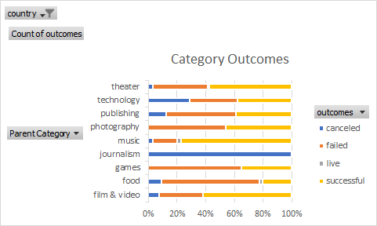
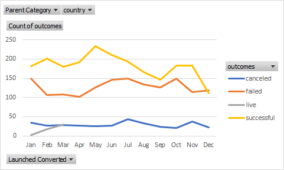
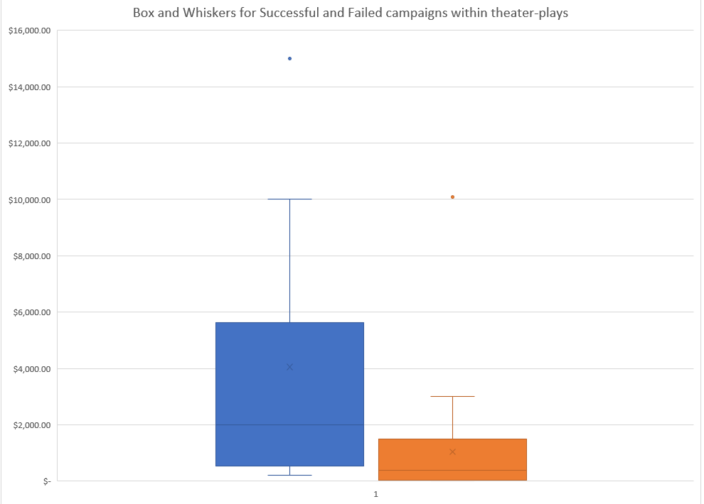

# kickstarter-analysis
Performing Analysis on Kickstarter data to uncover trends
#An Analysis of Kickstart Campaigns
Success, Failures, and statistics surrounding kickstarters in relation to goals, pledges, backers, countries, etc.

#Categories for all kickstarters and their outcomes- Success, Failures, Canceled, or Live.

Looking at all countries, and the key at the bottom right showing that sucesses are in yellow, we can see that theater,  has almost a 60 percent sucess rate. The only categories with higher success are music at almost 80 percent and film&video which are just above 60 percent. Theater proves to have a large percentage of sucessful campaigns on kickstarter.

#Launch Dates and Outcomes

Within all Cateogies, the best time to start a campaign would be April/May as sucesses are at their highest. It would be best to avoid the end of the calendar year.

#Theater Outcomes

Within theater, plays were the most common type of campaign. This may be good news for the campaign.

#Box and Whiskers

Within Plays, the average goal was about $4,000. It seems the majority of the data is skewed to less than $4,000, therefore the campaign should also be below $4,000 to be in line with other campaigns. Pledge amounts had much lower medians than the mean showing that there were not many high quantity pledges.
