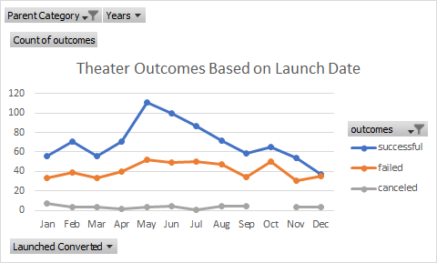
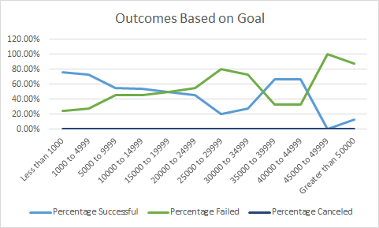

# Kickstarting with Excel

## Overview of Project
Louise wants to see how different play campaigns did in comparison to her sucess with Fever. This project is based on launch dates and funding goals as well as outcome. For this project, I will be excluding live campaigns as their outcome has not yet been determined.

### Purpose
Provide a visual representation of the outcomes of similar play campaigns with various goals and launch dates.

## Analysis and Challenges
### Analysis of Outcomes Based on Launch Date
  
I created a chart that looked at theater. Theater includes plays, musicals, and spaces. I added a column to my existing table for the launch year. I used the formula =YEAR() to create it and used the modified launch date calculated from the unix date. I created a pivot table focusing on  the outcomes of successful, failed, and canceled and these were assigned both the legend as well as values. I also used years as my axis. The assignment also called for filters for Parent Category and Years so I added those as well.
Looking at the successes, there were more sucesses than failed or canceled throughout the entire time except for December where canceled and sucessful seemed to intersect. Upon further review of the pivot table, it was clear they did not as successes is at 37 and failed is at 35.  It seems May was the most successful for theater from this chart as well.
It was also interesting to see that campaigns were not canceled in October throughout the years. That same month, there was an increase in both failed and sucessful campaigns. Overall failure of campaigns seemed steady throughout the year with the exception of October.

### Analysis of Outcomes Based on Goals

I created a table per instruction for the outcomes based on goal. I looked at 3 outcomes: Successful, Failed, and Canceled. I also looked at their goal ranges which I had to calculate using an IFS() formula based on plays, outcome, and for most upper and lower ranges except the less than 1000 and greater than 50000. I also summed up the values and created percentages for each outcome based on these values. When created the line chart, the data was reversed of how I wanted to look at it. That is to say that the percentage was showing on the x-axis and the ranges were showing on the y-axis. I switched rows/columns to ensure I got the same view as the challenge suggested.
I could see the inverse relationship between percentage sucessful and percentage failed. This is because there were no canceled projects. When successes went up, failures went down and vice versa.
What was most interesting was that, generally speaking, a low goal was more sucessful than a high goal of >45000. Most sucessful goals were under 5000, where the sucesses steadied and dropped before there was a peak between 35000 and 45000.
It is unsurprising that Louise's campaign was a success at the goal I suggested (which was less than 4000). However, she may have had luck with goals in the 35000-45000 - at least without seeing what the campaigns were about and if they had any reason to be high such as being a high profile campaign.

### Challenges and Difficulties Encountered
One of the challenges I faced was when I added a column after column S. I had added it there as I needed to extract the year from column R. However, when I tried inputing  the =YEAR(R1) it was inputting a full date (M/DD/YYYY) instead of just the YYYY. This was because the cells were set to date as that is how column R was set up. I didn't realize this at first but I found that adding the column at the end solved my problem.
Another challenge I faced was when adding a chart. The data presented itself as the ranges on the y-axis and the percentage on the x-axis. I had to switch the Row/Column in order to visual present it in a way that made sense with the range at the x-axis and the percentage as the y axis. 
I would have had more challenges if I did not know how to use IFs(). I had used IFS() before on a previous project so I felt very confident in using it. It may have taking me longer to look into what cells to select to represent the data as suggested where we showed the outcomes in each range for all plays.

## Results

- What are two conclusions you can draw about the Outcomes based on Launch Date?
May has the highest sucess of campaigns so that it a month that campaigns should launch for plays, and even theater.  December is the worst time to start a campaign.
- What can you conclude about the Outcomes based on Goals?
The highest sucesses of campaigns of plays were those that had goals of less than 5000 or between 35000 and 45000- at least that is what it seems like without diving in further to confirm the trend.

- What are some limitations of this dataset?
These charts do not include length of campaigns, the blurb about the plays that were most successful, number of backers, and types of backers that would support small goal campaigns versus larger goal campaigns. It is possible that higher goal sucessful campaigns had greater visibilty than the lower lower goal successful campaigns. There are also external factors such as the economy. 2009 was the first year of the kickstarter, and may have encountered less support in the month of May but these charts do not show that. I would need to modify or create new charts to represent all of these things.

- What are some other possible tables and/or graphs that we could create?
I coud have created year over years trends to make sure May has been trending high in the more recent years and that it hasn't shifted to another month over the years.  I would also show a chart where the average of donations per backer is higher and lower throughout those same months. I believe it would also be useful to read the blurbs of each play and see it different types of plays did better such as romance, historical, or even type of plays like musicals or opera versus spoken word or one man shows.
